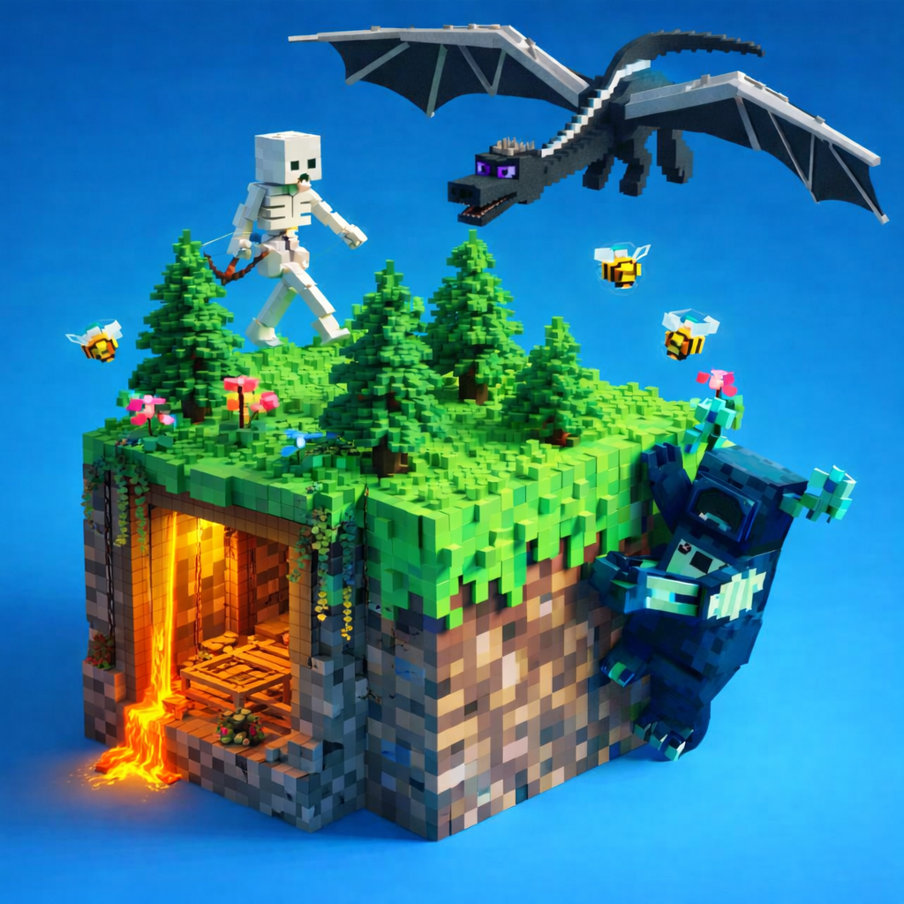

# Minecraft Vanilla+

A carefully curated Vanilla+ Minecraft modpack focused on
performance, immersion, and staying true to the core game.

## What is Vanilla+?
- No overpowered gear
- No bloated mechanics
- Vanilla gameplay, just enhanced

## Features
- Performance-focused Fabric stack
- Visual improvements (animations, lighting, models)
- Expanded biomes & world detail
- Carefully balanced QoL mods

## Installation Guide
docs/guides/README.md

## Version Info
- Minecraft: 1.21.1
- Loader: Fabric
